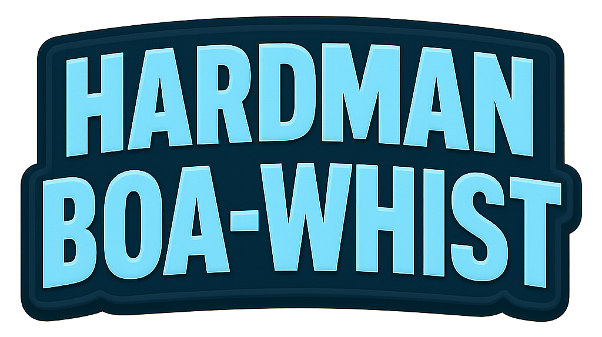
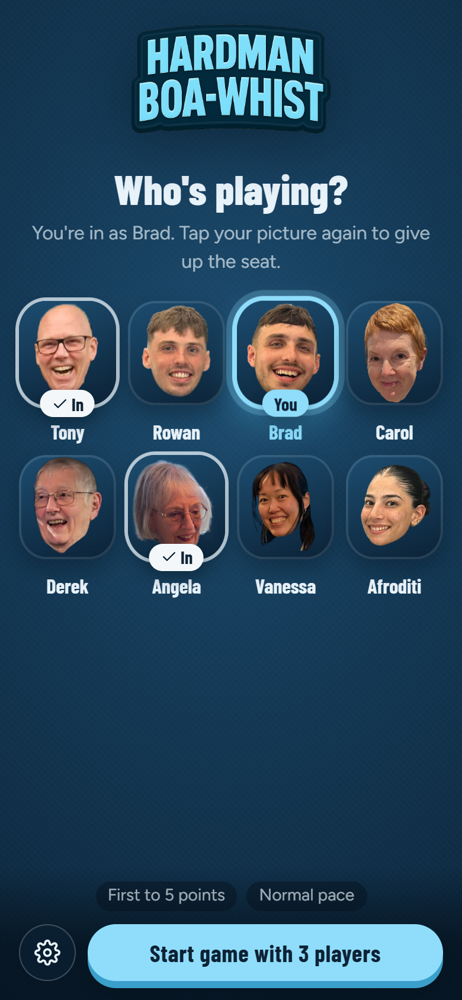
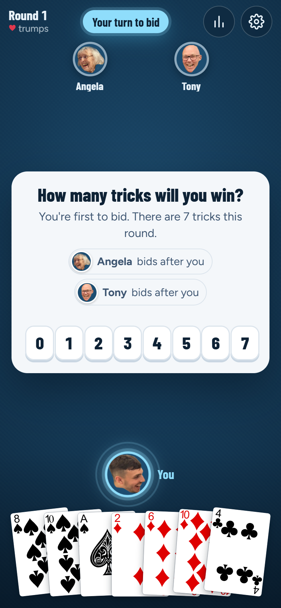
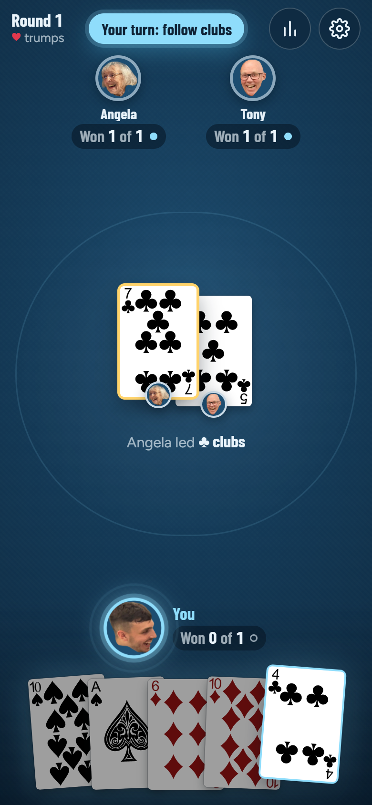
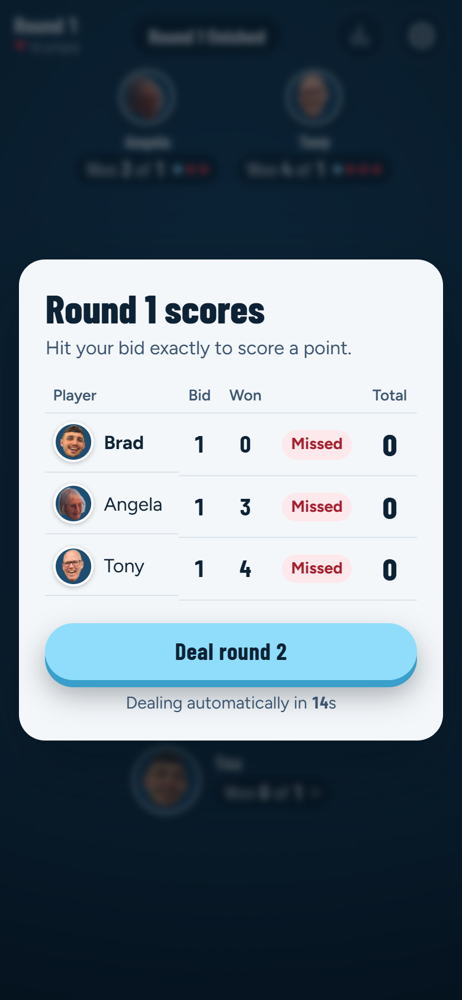

<p align="center">
  
</p>

<p align="center">
  <strong>The Hardman family's favourite card game, now on your phone.</strong><br />
  <a href="https://hardman-boa-whist.onrender.com/">▶ Play it at hardman-boa-whist.onrender.com</a>
</p>

---

Boa-Whist is a trick-taking card game for 2–7 players. Everyone is dealt 7 cards, guesses how many tricks they'll win, and then tries to win **exactly** that many: no more, no fewer. Hearts are always trumps. Hit your bid and you score a point. First to the target score wins.

Each player uses their own phone. Open the link, pick your face, and the server deals the cards, checks every move and keeps score.

<p align="center">
  
  
  
  
</p>

## How to play

### 1. Join the table

1. Everyone opens **https://hardman-boa-whist.onrender.com/** on their own phone or computer.
2. Tap the logo to get past the intro.
3. Tap your picture on the **Who's playing?** screen. You'll see a **You** badge on your own seat and an **In** badge on everyone else who has joined. Tap your picture again to give up the seat.
4. When at least two people are seated, anyone can press **Start game with N players**. There's a 3-second countdown, and anyone can cancel it. It's also cancelled automatically if someone joins, leaves or drops their connection.

> Everyone joins the same table, so there's no room code to share. Once a game has started, latecomers wait until it finishes.

### 2. Bid

Each round, every player is dealt **7 cards**. Starting with the first player and going round the table, each player picks a bid from **0 to 7**: the number of tricks they think they'll win.

**The last bidder can't make the bids add up to 7.** There are exactly 7 tricks in a round, so this means at least one person is guaranteed to miss. The app greys out the forbidden number for the last bidder.

### 3. Play the tricks

- The first player leads any card. Everyone then plays one card in turn.
- **You must follow suit** if you can (play a card of the same suit that was led). If you can't, you may play anything, including a trump.
- **Hearts ♥ are always trumps.** The highest heart wins the trick. If no hearts were played, the highest card of the suit that was led wins.
- Aces are high (2 is lowest, A is highest).
- Whoever wins a trick leads the next one.

Under each player you'll see a tracker like **Won 1 of 2**: tricks won so far out of what they bid.

### 4. Score

After all 7 tricks, the round summary shows each player's bid and how many tricks they won:

| Result | Points |
| --- | --- |
| Won **exactly** the number of tricks you bid | **+1** |
| Won more or fewer than your bid | 0 |

The next round deals automatically after a short pause (or press **Deal round N** to skip ahead). The first bidder moves one seat clockwise every round.

### 5. Win

The first player to reach the target score (**5 points** by default) wins. If two or more players reach it on the same round with the same score, play continues until one player is ahead on their own.

When the game ends you can start a rematch with the same players.

## Rules at a glance

| | |
| --- | --- |
| Players | 2–7 |
| Cards | Standard 52-card deck, 7 cards each, every round |
| Trumps | Hearts, always |
| Bids | 0–7; the last bidder can't make the total 7 |
| Follow suit? | Yes, if you can |
| Scoring | 1 point for hitting your bid exactly |
| Winning | First to the target score (1–5, default 5), with a clear lead |

## Settings

Tap the ⚙️ button in the lobby or during a game.

- **Points to win** (1–5): set in the lobby before the game starts.
- **Game pace** (Relaxed, Normal, Quick): how long the table pauses between tricks and rounds. Applies to everyone.
- **Text size**, **sound effects volume**, **music volume** and **flash the screen edge when it's my turn**: these only apply to your own device.

The 📊 button during a game shows the full scoreboard.

## If someone drops out

If a player loses connection mid-game, their seat is marked **Away**. The table waits 20 seconds for them to come back, then plays a sensible move for them, using the same thinking as a Medium computer player. Anyone at the table can tap **Play for … now** to skip the wait. When the player reconnects, they carry on from where they left off.

In the lobby, a seat is released if its player has been gone for 30 seconds.

## Practise with computer players

Computer players show up as **Player 2**, **Player 3** and so on, each with a robot picture in its own colour instead of a family face. They follow the same rules as everyone else, and the server checks every move they make.

- **Adding them:** tap the robot button next to ⚙️ in the lobby, then **+ Add**. Tap ✕ on a computer player to remove it.
- **Playing on your own:** if you're the only person seated when the game starts, it automatically moves to a private table, so the family lobby stays free for everyone else. Your face shows **Practising** in the family lobby. If you leave mid-game, the computer players wait for you to come back. **Back to lobby** returns you to the family lobby with the same computer players.
- **Playing with family:** with two or more people seated, computer players simply fill the empty seats at the family table.
- **Difficulty** applies to all the computer players at the table:
  - **Easy** plays by rules of thumb and sometimes misjudges a bid or plays a loose card.
  - **Medium** looks ahead a little before each bid and card.
  - **Hard** imagines hundreds of ways the hidden cards could be dealt, plays each one out, and picks whatever most often lands exactly on its bid.

Computer players don't cheat: they only know their own hand and what has been played in front of everyone.

## Running it locally

You'll need [Node.js](https://nodejs.org/) 18 or later.

```bash
npm install
```

Start the game server (port 3000):

```bash
npm run start-server
```

In a second terminal, start the Vite dev server for the front end (port 5173):

```bash
npm run dev
```

Then open http://localhost:5173. To try a multiplayer game on one computer, open extra windows in private/incognito mode: each one counts as a different player.

To run it the way it's deployed (one server for the game and the built front end):

```bash
npm run build
```

```bash
npm run start-server
```

Then open http://localhost:3000.

### Project layout

| Path | What's there |
| --- | --- |
| `server/server.ts` | Express + Socket.IO server: rooms, turns, timers and broadcasting game state |
| `server/utils/` | Game rules: dealing, follow-suit and trick winners, bidding rules, scoring |
| `server/bot/` | Computer players: what each one may see, the Easy/Medium/Hard strategies, and the Monte Carlo search |
| `shared/types.ts` | Types shared by the client and server |
| `src/` | Svelte front end (lobby, game board, bidding, scoreboard, settings) |
| `public/` | Card images, player avatars, fonts and the logo |

The server is authoritative: it shuffles and deals, validates every bid and card, works out who won each trick, and only sends each player their own hand.

### Deployment

The live game runs as a single web service on [Render](https://render.com/). The server serves the built front end from `dist/`, so the service needs to run `npm run build` and then `npm run start-server`. Set `CORS_ORIGIN` (comma-separated) only if the front end is served from a different origin than the server.
